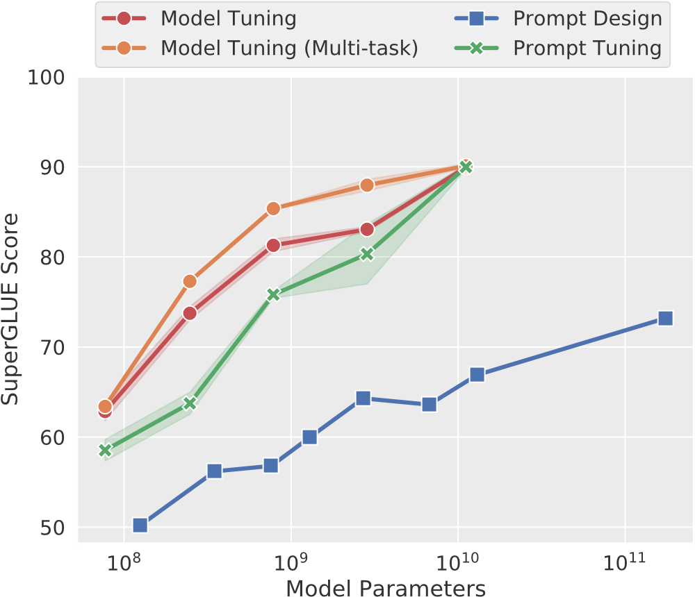

Brian Lester;

Rami Al-Rfou;

Noah Constant.

Google Research.

[arXiv首页](https://arxiv.org/abs/2104.08691)

[论文pdf](https://arxiv.org/pdf/2104.08691.pdf)

EMNLP 2021.

continuous prompts(soft prompts)。效果随参数规模变大而增强，并在参数量超过billion量级时效果与finetune相当。

# motivation

[Brown et al., 2020]()提出用task description and/or several canonical examples组成prompt来调制GPT-3、以此替代fine-tuning。
然而这样的方法有几个问题：task description易于发生错误、需要人类工作、有效性约束性较大。
[Shin et al., 2020]()提出一种在离散的word space上做搜索的算法，效果高于manual prompt、但仍劣于model tuning。

[Li and Liang, 2021]()提出prefix tuning，即固定模型参数、而只更新每层预制的prefix activations，在generative tasks上结果斐然；
[Hambardzumyan et al., 2021]()简化了该方法，只允许训练masked language model的输入、输出子模块，在classifications tasks有不错的效果。

本文提出prompt tuning做了更进一步的简化，它每个下游任务只允许训练额外*k*个tunable tokens，不需要在中间层的prefix或task-specific的输出层。
同时，这种做法依然competitive with model tuning。

值得注意的是，language model capacity（模型参数量）是这些方法有效性、高效性的重要因素。

# TODO