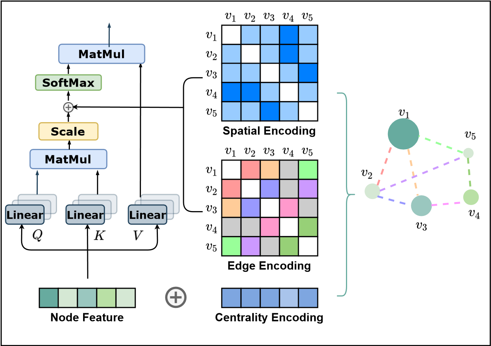

Chengxuan Ying, Dalian University of Technology;

Tianle Cai, Princeton University;

Shengjie Luo, Peking University;

Shuxin Zheng, Microsoft Research Asia;

Guolin Ke, Microsoft Research Asia;

Di He, Microsoft Research Asia;

Yanming Shen, Dalian University of Technology;

Tie-Yan Liu, Microsoft Research Asia.

[arXiv首页](https://arxiv.org/abs/2106.05234)

[pdf](https://arxiv.org/pdf/2106.05234.pdf)

[代码](https://github.com/Microsoft/Graphormer)

Jun, 2021.

提出Graphormer，将transformer用到graph领域的graph-level prediction任务上。
在该任务的榜上达到SOTA。

# motivation

transformer最初用于sequence modeling，在图领域使用它需要正确融合图的structural information。

self-attention只能计算两个点的semantic similarity，而不能考虑结构信息和边信息。
Graphormer为了解决这个问题，使用了集中structural encoding来利用这些信息。

# method

## centrality encoding

希望能够描述每个点在图中的重要性。
比如在社交网络中，有很多关注者的名人在图中有非常大的影响。
而attention机制忽视了这一点。

graphormer使用degree centrality作为additional signal。

$$h_i^{(0)} = x_i + z^-_{deg^-(v_i)} + z^+_{deg^+(v_i)}$$

## spatial encoding

attention需要显式地区分不同的位置或者编码positional dependency。
对于sequential data，可以通过positional encoding来完成；
在图领域，本文提出新的encoding方法。

$\phi(v_i, v_j): V \times V \rightarrow \mathbb{R}$定义为两点之间的最短路。若两点不相连，则设为特殊值-1。
$\phi$的每种取值对应一个learnable scalar作为self-attention的bias。

$A_{ij}$是Query-Key prodect matrix $A$的第(i,j)元素。

$$A_{ij} = \frac{(h_i W_Q)(h_j W_K)^T}{\sqrt{d}} + b_{\phi(v_i, v_j)}$$

这种设计相较于传统的GNN（基于聚合的GNN），每个点能干预的点不再受限于与它相交的点；
同时，$b_{\phi(v_i, v_j)}$让它们能够adaptively获取其它点的信息。

## edge encoding

本文截止至此，模型还没有办法利用任何edge feature。

前人作edge encoding主要有两种做法：
- edge feature直接加到相连的node feature
- 在聚合（message passing）过程中使用edge feature

这些方法中，edge feature只能将边信息传播到与之相连的点。

在本文中，提出一种新的encoding方法。
对于任何两点$(v_i, v_j)$，找到（其中一个）最短路$SP_{ij} = (e_1, e_2, \cdots, e_N)$，计算edge feature在embedding之后、沿着SP的平均值；
然后作为额外的bias放入attention中。

$$A_{ij} = \frac{(h_i W_Q)(h_j W_K)^T}{\sqrt{d}} + b_{\phi(v_i, v_j)} + c_{ij}, where c_{ij} = \frac{1}{N} \sum^N_{n=1} x_{e_n} (w^E_n)^T$$

## layer

- LN = Layer Normalization
- MHA = Multi-Head self-Attention
- FFN = Feed-Forward Blocks

$$h'^{(l)} = MHA(LN(H^{(l-1)})) + h^{(l-1)}\\
h^{(l)} = FFN(LN(h'^{(l)})) + h'^{(l)}$$

## sepcial node

过去有很多graph pooling的方法。
本文通过添加一个特殊节点[VNode]并让每个点都与其连接，用其做最终的节点表示。

特别的，为$b_{\phi([vNode], v_j)}$和$b_{v_i, \phi([vNode])}$另设不同的learnable scalar。

# 结果

## 理论分析

graphormer和aggregation-based GNN效果有何差距？

传统的GNN可以视为graphormer的特例；
理论上，GNN的能力上限是1-WL test，而graphormer的能力超过1-WL test。

Graph pooling的方式上，GNN使用的是简单的加和或取平均；
而virtual node加self-attention可以更好地聚合信息。

## 实验结果

## Ablation Study

