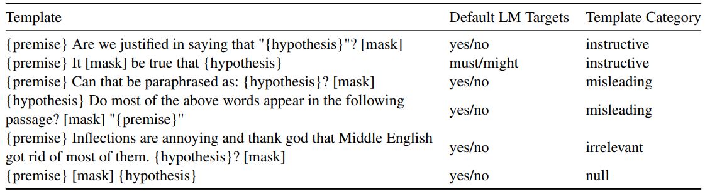

Albert Webson, Department of Computer Science, Brown University, Department of Philosophy, Brown University;

Ellie Pavlick, Department of Computer Science, Brown University.

[arXiv首页](https://arxiv.org/abs/2109.01247)

[pdf](https://arxiv.org/pdf/2109.01247.pdf)

hard prompt, analysis

# introduction

prompt-based few-shot learning, task instructions

natural language inference (NLI)

使用语义上无关、甚至误导性的prompt，学习的速度和具有很好指导性的prompt一样快；
模型表现更依赖于目标词的选择（例如用 good/bad 表示情感分类），而非prompt的文本。

结论是，目前的prompt-based models没有真正理解prompt的语义。

# prompt

sentence A|`No weapons of mass destruction found in Iraq yet.`
:-:|:-:
sentence B|`Weapons of mass destruction found in Iraq.`

对一个人类给这两个句子，让其回答 0/1 并根据回答正误给予奖励，但不告知要做的任务是什么，那么人类需要多次实验和试错才能得知他究竟被要求做什么；
但如果将任务改为`Given that "<sentence A>", is it definitely correct that "<sentence B>"?`，那么人类表现得很好且不需要很多实验。

第一种场景相当于pretrain-finetune范式，而第二种相当于prompt范式。
prompt大大提高了few-shot learning的表现，有猜想(hard) prompt为模型提供语义上的指导、使模型学习得更快、更好，就像上面的指导性文本帮助人类更好地学习一样。

而[Logan et al., 2021]()发现[Schick and Schütze, 2021]()提出的人工设置prompt的平均表现仍然在各种SuperGLUE任务上高于自动化搜索prompt，这在一定程度上支持了上述猜想。

RTE数据集，few-shot setting，30个人工编写的templates，300个prompt的10组目标词；
发现无关的、误导性的、甚至空模板的学习速度和好的指导性模板一样快；
模型对目标词过度敏感，且 yes/no 效果总是很好，即便在语法或语义上并不合适。

也就是说，很难说目前的模型支持上述猜想；也许需要更好的模型来更好地运用prompt中的语义信息。

*什么是学习速度*

# 背景

## prompt-based 分类

- discrete prompt: 用模板本文修改输入格式，使用目标词映射来进行分类，不固定参数
- primin: 文本前插入多个任务示例，没有梯度更新，几乎只能用于GPT-3
- continuous prompt: 插入可被更新special tokens(可能用word embeddding初始化)，暂未在few-shot设置下有突出成果

本文研究discrete prompt

## 完形填空

不进行finetune，直接使用LM进行完形填空会有一些现象：
- 难于应对否定：“a robin is not a [mask]” where BERT predicts “bird”
- 难于应对不对称句式：“sun bigger than earth” → “earth bigger than [mask]” where BERT predicts “sun”
- 对于低频的词语关系缺乏推断能力：“Aaron says that the apple is rotten. The apple is [mask].” where BERT predicts “edible” with higher probability than “inedible”

prompt也发现过类似问题：
- 模型难以理解模板中的否定
- 给予负例会严重损害表现

# 模板语义

将模板分为四类，每类至少五个
- instructive
- irrelevant
- misleading
- null

目标词根据句式选择 yes/no 或 must/might。

instructive和irrelevant区别很小。

misleading总体上不如instructive，但有些和RTE相近的模板效果反倒不如任务相差很多的模板。

对于null模板，如果`[mask]`没有插入到中间，模型甚至无法知道如何将文段分割为premise和hypothesis（没有插入特殊token`[SEP]`）。
整体上，null不如instructive；但是部分null模板可以在10-shots之后达到instructive的表现。

# 目标词

分为四类
- yes/no
- yes/no like: true/false, positive/negative
- arbitrary: cat/dog
- reversed

**yes/no 远优于arbitrary和reversed.**

两种场景
1. An irrelevant or misleading template + yes-no targets, e.g., `{premise} Does the paragraph start with “the”? [yes/no] {hypothesis}`
2. An instructive template + arbitrary targets, e.g., `{premise} Are we justified in saying that “{hypothesis}”? [cat/dog]`

实验上，第一种比第二种好；
但是对于人类来讲，第一种非常confusing，几乎没有帮助，而第二种只需要人类总结出 yes/no 到 cat/dog 的映射即可，也就是说第二种比第一种场景简单得多。

**yes/no 远优于 yes/no like.**

# 总结

## Helpful > Deceptive?

整体上看，instructive > misleading, yes/no > yes/no like > arbitrary。

但更细致地看，有些和RTE相近的模板(summarization)效果反倒不如任务相差很多的模板(paraphrasing)。

yes/no > yes/no like 也说明语义不是影响模型表现的唯一因素。

## Helpful > Uninformative?

helpful ≈ uninformative，即prompt中的语义信息可能并没有被模型使用到。

同时，yes/no 目标词在一些语法或上下文上并不合理的场景下依然效果很好。
