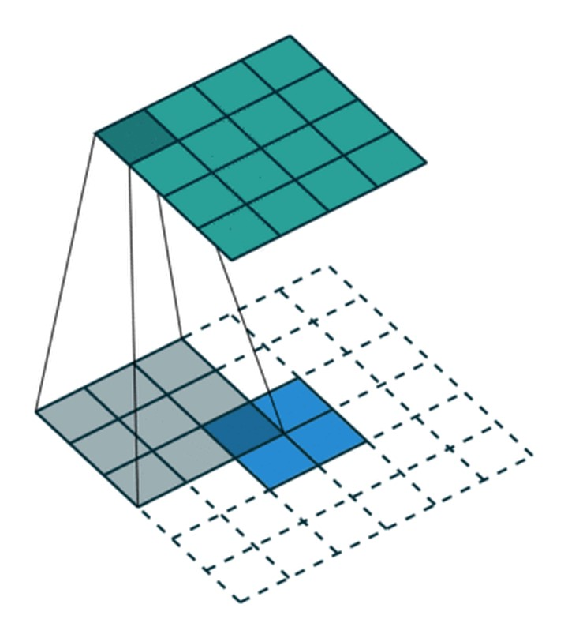
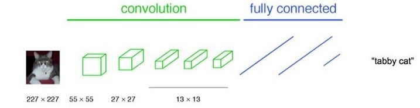
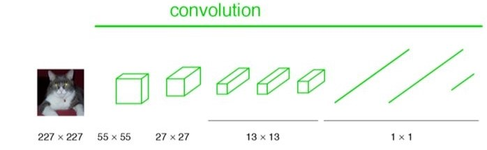
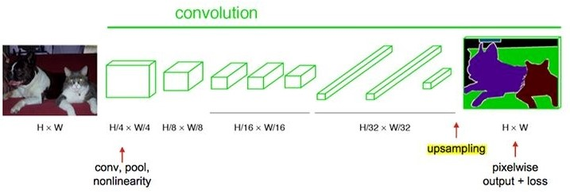
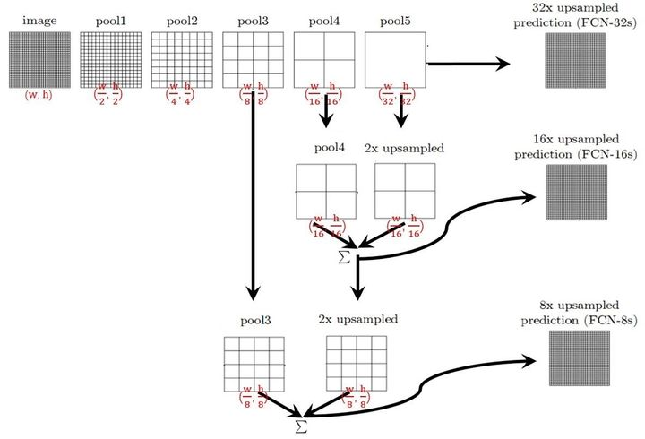
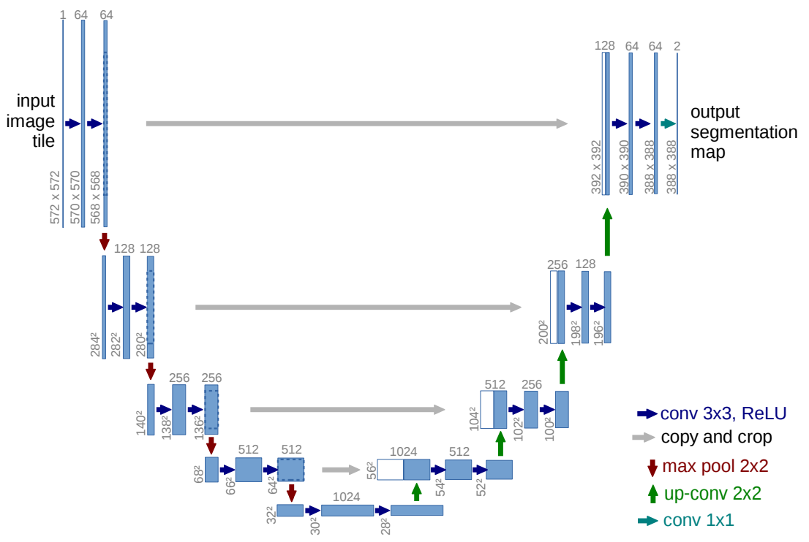
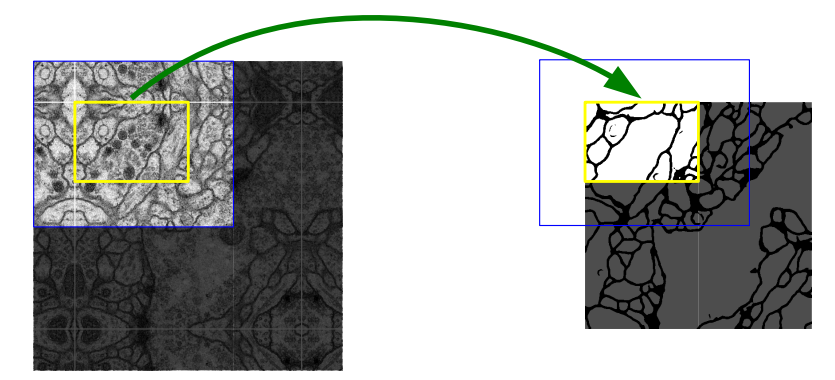

图像分割经典方法：FCN & U-Net。

# FCN

[Fully Convolutional Networks for Semantic Segmentation](https://arxiv.org/abs/1411.4038)

Jonathan Long, UC Berkeley;

Evan Shelhamer, UC Berkeley;

Trevor Darrell, UC Berkeley.

全卷积网络（Fully Convolutional Networks），CVPR2015

Cited 25307.

将deep, coarse layer输出的semantic information和shallow, fine layer输出的appearance information结合。

通过反卷积层将最后一层卷积层输出恢复成原尺寸，对每个像素做预测。

## 反卷积层/上采样

将浓缩的、尺寸较小的输入变成尺寸较大的输出

## 全卷积

正常CNN

------------

FCN用于分类任务

-----------

FCN用于分割任务

接受任意大小的图片

# U-Net

[U-Net: Convolutional Networks for Biomedical Image Segmentation](https://arxiv.org/abs/1505.04597)

Olaf Ronneberger, Computer Science Department and BIOSS Centre for Biological Signalling Studies, University of Freiburg, Germany;

Philipp Fischer, Computer Science Department and BIOSS Centre for Biological Signalling Studies, University of Freiburg, Germany;

Thomas Brox, Computer Science Department and BIOSS Centre for Biological Signalling Studies, University of Freiburg, Germany.

MICCAI 2015

Cited 38166

使用小规模数据集。

## architecture

下采样获取语义信息。
深层信息和浅层信息融合时，不是pixel-wise相加（FCN），而是channel拼接。

## overlap-tile strategy

输入图像和输出图像的尺寸不一样，有缩小。

为了在较大图片上也可以运行（而不局限在固定维度），将原图像做分割。
但分割边缘处可能不准确，所以输入框比输出框大；
在边界的时候，做镜像延拓。

## 数据增强

做的任务是细胞分割的任务（在显微图像中做像素级二分类，判断是否为细胞）。
已知先验知识是细胞形状不固定、有平移旋转不变性，用弹性形变、旋转、平移、灰度处理做数据增强。

