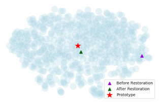
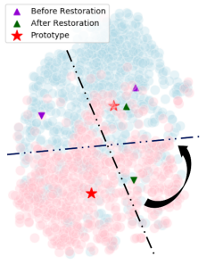

Wanqi Xue, Department of Computer Science, National University of Singapore;

Wei Wang, Department of Computer Science, National University of Singapore.

[arXiv首页](https://arxiv.org/abs/2005.01234)

[pdf](https://arxiv.org/pdf/2005.01234)

AAAI2020

Cited 11

few-shot的常见方法:

- metric-learning = prototypical network: 将图像映射到metric space，保证相同类别图像的输出比较靠近。class agnostic knowledge
- MAML

metric-learning在one-shot learning上表现不佳。

## motivation

将同类别图像对应的feature vector的中心点（平均值）称为prototype。

metric-learning用大规模带标注数据训练prototypical network(简记为ProtoNet)，输入图像、输出feature vector。

在inference阶段，support set中每个类别只有一个图像，对应的feature作为prototype；query set中的每一个图像的feature找距离最近的prototype作为分类结果。

但是support set图像的feature和实际的class center可能有较大误差（扰动）。

## methodology

创新点

### RestoreNet

使用MLP，输入为图像的feature，输出为对应类别的prototype；用来消除扰动。

在inference阶段，将初始prototype（即support set图像的feature）称为$\boldsymbol{p}_c$ ，用$R(\boldsymbol{p}_c)={1\over2}M(\boldsymbol{p}_c)+{1\over2}\boldsymbol{p}_c$替代之，其会更接近真实的class center。

### self-training

在inference阶段，当对query set中某一个图片进行分类时，将query set中其它图片的集合简记为$U$。对于每个类别$c$，取$U$中距离$\boldsymbol{p}_c$的前$\gamma$（超参）近的feature加入support set，将得到的prototype记为$\widetilde{\boldsymbol{p}_c}$，用$R(\widetilde{\boldsymbol{p}_c})$来分类。

## experiment

### dataset

- miniImageNet
- CIFAR-100
- Caltech-256
- CUB-200

### visualization

# result

miniImageNet: 59.28+-0.20, 61.14+-0.22(self-training)

CIFAR-100: 66.87+-0.94, 69.09+-0.97(self-training)

Caltech-256: 64.10+-0.89, 68.28+-0.96(self-training)

CUB-200: 74.32+-0.91, 76.85+-0.95(self-training)