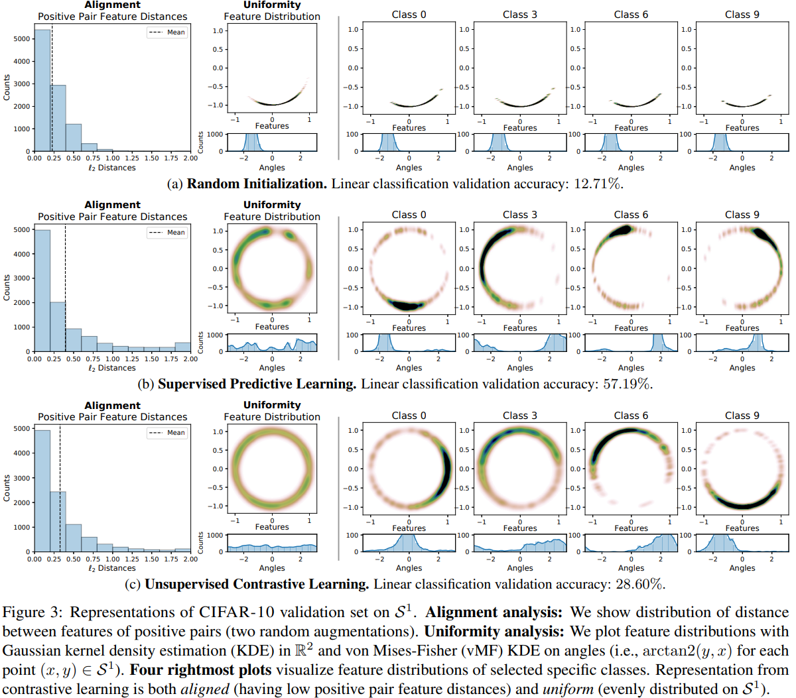
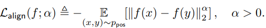
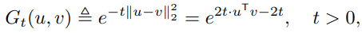
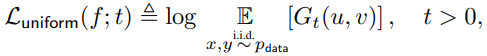

Tongzhou Wang, MIT Computer Science & Artificial Intelligence Lab (CSAIL);

Phillip Isola, MIT Computer Science & Artificial Intelligence Lab (CSAIL).

[首页](http://proceedings.mlr.press/v119/wang20k.html)

[pdf](../assets/wang20k.pdf)

[Supplementary](http://proceedings.mlr.press/v119/wang20k/wang20k-supp.pdf)

[code](https://github.com/SsnL/align_uniform)

ICML 2020.

Cited 269.

# background

## 在hypersphere上的表示学习

通过一些无监督对比学习或其它方法，将输出空间限制在单位超球(unit hypersphere)上，也可以理解为$l_2$ norm限制。

概括性地看，这种做法可以提高稳定性（如果大量出现点乘操作）；
如果模型有良好的聚类能力，那么线性分割曲面也更方便。

具体来看，在许多具体做法，比如VAE模型中和Prototype Network中，使用hypersphere作为特征空间比欧氏空间要好。

## alignment & uniformity

考察模型的两种性质：
- alignment: 同类feature相近，对无关的噪声因素有不变性
- uniformity: feature均匀分布（feature保有最大信息）

## main contribution

- 对上述两种性质，提出了有理论支撑的metric
- 证明了contrastive loss是对上述两种性质的渐进优化
- 以提出的metric为loss，其在下游任务表现优于对比学习

# 理论分析 & 实验

## 小实验

使用AlexNet，使用三种设置：
- 随机初始化
- 有监督学习（有数据增强）
- 无监督对比学习（有数据增强）

对比学习得到的表示更加均匀，且正例分布更聚拢。
不过，其实际的分类效果并不好，因为训练的目标和分类不一致。

## 定量描述Alignment & uniformity

Alignment loss:

Uniformity loss，利用高斯核（径向基函数RBF，沿径向对称）。

实验表示直接对二者进行训练、或者在对比学习后用二者进行finetune都能提高结果。

## discussion

TODO