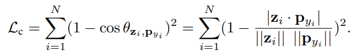

Pascal Mettes, ISIS Lab, University of Amsterdam;

Elise van der Pol, UvA-Bosch Delta Lab, University of Amsterdam;

Cees G. M. Snoek, ISIS Lab, University of Amsterdam.d

[首页](https://arxiv.org/abs/1901.10514)

[pdf](https://arxiv.org/pdf/1901.10514.pdf)

[code](https://github.com/psmmettes/hpn)

NIPS 2019.

Cited 41.

可做回归/分类任务。

# 分类

先在超球上均匀采样分类种数个点，将其固定为每个种类的prototype，然后让样本feature向其靠近。

TODO

用复杂的方法定位prototype；
用word embedding来帮助prototype的更新。

# result

## classification

CIFAR-100: 65.0+-0.3

ImageNet-200: 44.7+-0.3