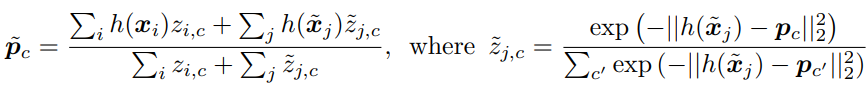
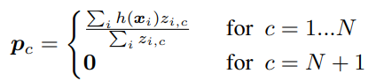
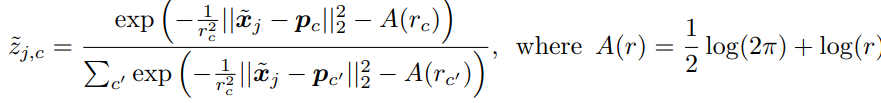
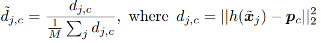
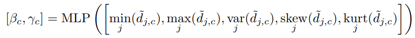
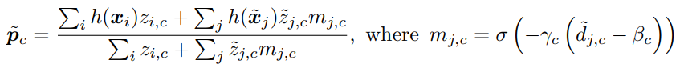

Mengye Ren†on, University of Toronto & Vector Institute;

Eleni Triantafillou, University of Toronto & Vector Institute;

Sachin Ravi, Princeton University;

Jake Snell†on, University of Toronto & Vector Institute;

Kevin Swersky, Google Brain;

Joshua B. Tenenbaum, MIT;

Hugo Larochelle, Google Brain & CIFAR;

Richard S. Zemel, University of Toronto & CIFAR & Vector Institute.

[首页](https://arxiv.org/abs/1803.00676)

[pdf](https://arxiv.org/pdf/1803.00676.pdf)

[code](https://github.com/renmengye/few-shot-ssl-public)

# soft k-means

每个无标注都参与到了每个类别的调整过程。
过程可以迭代多次，但实验表明多于一次迭代没有效果提升。

需要保证无标注数据必然属于待分类的类别之一。

# soft k-means with a distractor cluster

新增一个无关类。
引入新的长度因素$r_c$，若c为正常类别则恒为1，若为新增的无关类则可学习。

# soft k-means and masking

对第二种进行改进。

