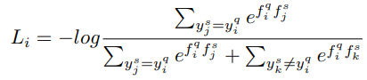

Chen Liu, School of Data Science, and MOE Frontiers Center for Brain Science, Fudan University;

Yanwei Fu, School of Data Science, and MOE Frontiers Center for Brain Science, Fudan University;

Chengming Xu, School of Data Science, and MOE Frontiers Center for Brain Science, Fudan University;

Siqian Yang, YouTu Lab Tencent;

Jilin Li, YouTu Lab Tencent;

Chengjie Wang, YouTu Lab Tencent;

Li Zhang, School of Data Science, and MOE Frontiers Center for Brain Science, Fudan University.

[首页](https://ojs.aaai.org/index.php/AAAI/article/view/17047)

[pdf](https://www.aaai.org/AAAI21Papers/AAAI-2249.LiuC.pdf)

[code](https://github.com/corwinliu9669/Learning-a-Few-shot-Embedding-Model-with-Contrastive-Learning)

Learning a Few-shot Embedding Model with Contrastive Learning

AAAI 2021

infoPatch

# method

## contrastive learning with infoNCE

对于query set的每个图片$x_i^q$，其对应loss为：

也就是说，将support set中的同类图片作为正例、非同类图片做负例，做对比学习。

将有监督loss和上述的infoNCE loss结合起来，权重分别是1和0.5。

值得注意的是，这里计算两个向量相似度的方式内积。

## hard samples

有前人指出，对比学习的重点在于找到hard samples，这样能让模型学到更多信息。
同时，辨别图片不一定要看整张图，只用部分图来训练*可能*能增强泛化能力（few-shot learning非常看重泛化能力，因为其训练集和测试集的类别不相交）。

因为在episode training阶段，support set和query set担任的角色不同，所以对二者做的数据增强也不同。
对于support set，将其看作matching template，尽量修改较少，所以使用随机mask，这样更难辩别物体；
对于query set，希望模型能够只关注图像的某一部分也能得到正确输出，所以用网格将一张图片分成多个patch，分别计算loss。

## PatchMix

这部分的motivation是让模型能够应对从未见过的class，消除training set自身存在的data bias。

采用了[Cutmix](https://openaccess.thecvf.com/content_ICCV_2019/html/Yun_CutMix_Regularization_Strategy_to_Train_Strong_Classifiers_With_Localizable_Features_ICCV_2019_paper.html)类似的方法，对于一个query image，在query set中另采样一个图像，用Cutmix的方法随机选择图像框，将框内内容替换。在这里，图像label不变。（论文没有提到另采样的图片是否必须和原图片不同类，但是按他的motivation来讲，应该是不同类的；但是，直观分析来讲，同类图片替换*应该*不影响）

# Ablation on grid size

网格大小越大，效果越好。

有论断说，将局部的feature和全局feature更相近，能够提升模型效果，背后的intuition是什么？