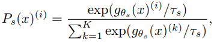

Mathilde Caron, Facebook AI Research & Inria∗;

Hugo Touvron, Facebook AI Research & Sorbonne University;

Ishan Misra, Facebook AI Research;

Herve Jegou, Facebook AI Research;

Julien Mairal, Inria;

Piotr Bojanowski, Facebook AI Research;

Armand Joulin, Facebook AI Research.

[arXiv首页](https://arxiv.org/abs/2104.14294)

[pdf](https://arxiv.org/pdf/2104.14294)

[code](https://github.com/facebookresearch/dino)

1. 自监督ViT输出的feature具有更明确的语义分割信息，而有监督ViT或CNN都没有这一点。
2. 自监督ViT能很好地用于k-NN，即便没有finetuning、线性分类器、数据增强
3. 本文强调momentum encoder, multi-crop training, small patches with ViT的作用

DINO(self-DIstillation with NO labels)

# method

用同架构的两个模型student network$g_{\theta_s}$和teacher network$g_{\theta_s}$，他们会输出相同维度的概率分布：

如果是按照知识蒸馏的架构，那么训练目标是：

而在这里，对一个图片生成不同的crop（修剪），其中包括两个global views$x_1^g x_2^g$（高分辨率）和多个local views（低分辨率），其中global views用做teacher network的输入、local views用做student network的输入，这样可以鼓励local-to-global的一致性。训练目标是用SGD优化：

teacher network在一个epoch中固定，并在该epoch结束后用以下公式更新：

其中λ在取值为[0.996, 1]之间用cosine schedule。

backbone为ViT或ResNet加上一个projection head（3层MLP），而在用于下游任务时弃用projection head。
另外，ViT默认不使用batch norm。

避免collapse **TODO** 没看懂

# detail

pretrained on ImageNet without labels, 
a batch sizeof of 1024 over 16 GPUs, 